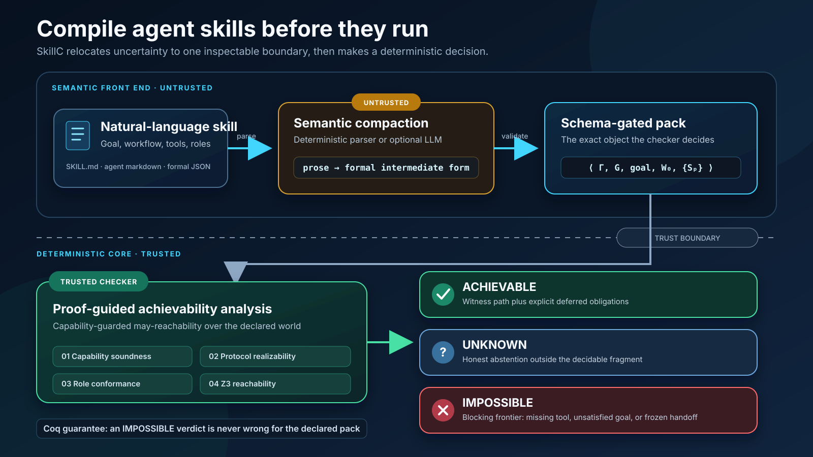
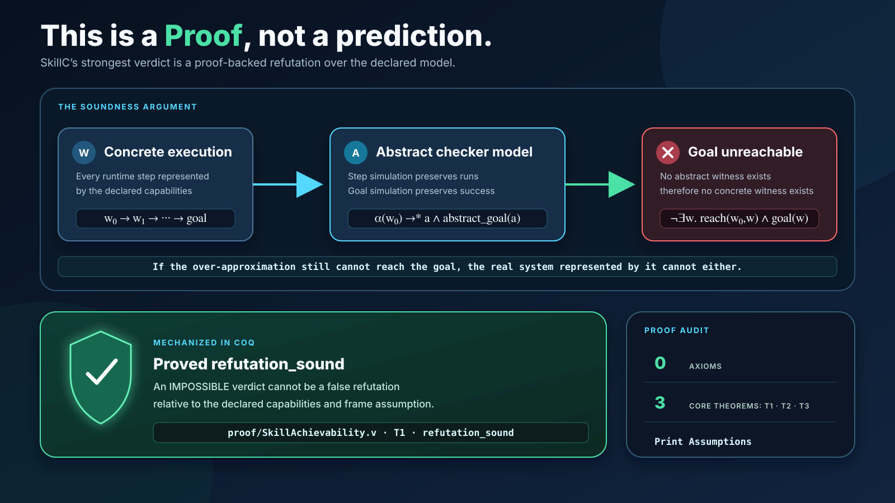
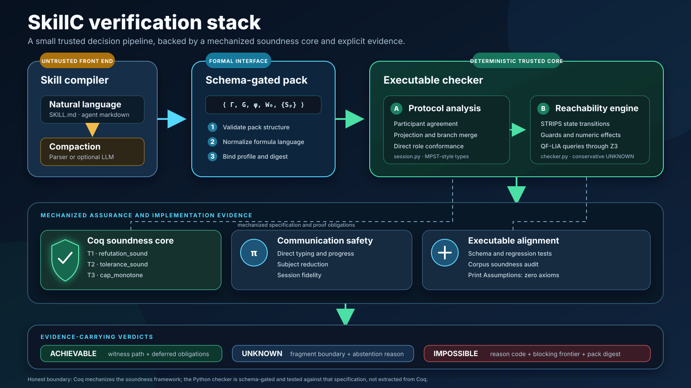
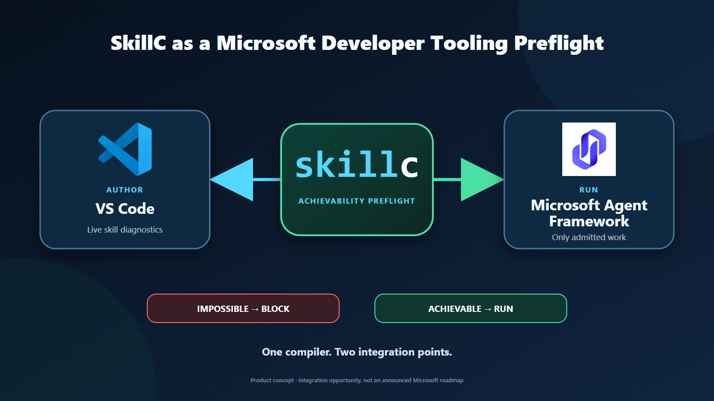
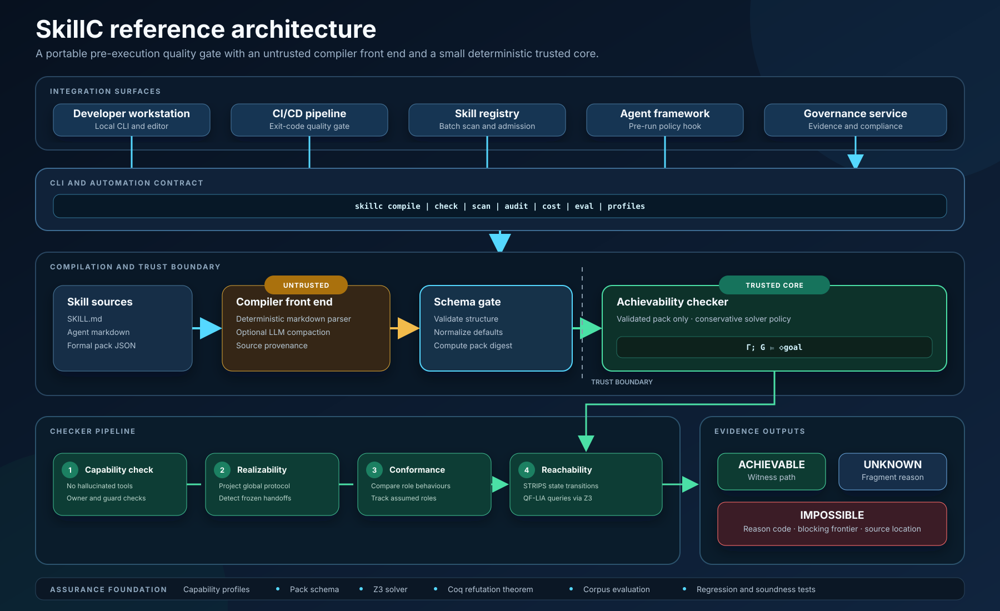

# 🛑 Before Any Execution Token Is Wasted

### ⚙️ SkillC is the achievability compiler for agent skills

AI agents burn tokens pursuing goals they can never achieve. A tool is missing.
A constraint has no solution. Two agents wait forever for each other. Teams
usually discover these failures only after the agent has reasoned, retried, and
spent its runtime budget.

SkillC catches them before execution. It compiles an agent skill into a formal
model of its goal, tools, constraints, and coordination protocol, then checks
whether the goal is reachable in the declared environment.

If the answer is `IMPOSSIBLE`, SkillC names the blocker so an integrating
runtime or CI gate can stop the run.

> **Not another LLM judging an LLM. A compiler backed by a formal framework.**

---

## 🚨 Why agents need a compiler

Programming languages have compilers that reject invalid programs before they
run. Agent skills are becoming the language we use to program agents, but we
still ship them without checking whether their goals are reachable.

Today's loop is expensive:

```text
write -> run -> fail -> inspect traces -> patch -> retry
```

Watch the [10-second runtime-cost animation](./videos/agent-runtime-cost_save.mp4),
timed for the 0:08-0:18 narration, or open the
[editable browser version](./videos/agent-runtime-cost.html).
This original illustration uses fictional token counts, not recorded benchmark
data. The silent MP4 is 1920x1080 at 30 fps, ready for voiceover.

The [game-style version](./videos/agents-game.mp4) shows six robot agents
running between workstations, retrying, waiting, and rerouting before all six
discover the missing email tool and fail. It uses the same 10-second timing,
1080p format, and fictional token counts. Bottom narration captions and the
in-video progress bar are omitted;
the robot animation, token counter, and failure labels remain. Open the
[game preview](./videos/agents-game.html) to play or scrub the scene.
Regenerate it with `npm run render:game --prefix docs\videos` after installing
the video package's dependencies; rendering requires Microsoft Edge and FFmpeg.

SkillC moves failure discovery to compile time:

```text
author -> compile -> check -> reject impossible work -> run what remains
```

The [meeting-goal animation](./videos/skillc-meeting-proof.mp4) illustrates
that check with logical blocks: `scheduled AND invited_all`. The declared
mailbox can schedule, but no available action can establish `invited_all`.
The checker finds the conjunction unreachable and stops execution with
`IMPOSSIBLE`. This is a simplified illustrative model, not a live mailbox
check or a recording of SkillC output.
The [interactive preview](./videos/skillc-meeting-proof.html) supports scrubbing.
The silent MP4 is 14 seconds at 1920x1080 and 30 fps.
Regenerate it with `npm run render:meeting --prefix docs\videos`.

The [code-and-terminal version](./videos/skillc-meeting-terminal.mp4) shows
the [actual input pack](./videos/meeting-mailbox.pack.json), excerpts from the
Python checker, and [captured CLI output](./videos/meeting-mailbox.verdict.json).
The local checker returns `IMPOSSIBLE [GOAL_UNSAT]` with frontier `invited_all`
and exit code 1. The input is a hand-authored example, not a live mailbox
probe; the 18-second animation edits timing for readability. Narration captions
are omitted; code, terminal output, explanations, and verdict labels remain.
Use the [terminal preview](./videos/skillc-meeting-terminal.html) to scrub it.
Capture fresh evidence with `npm run capture:terminal --prefix docs\videos --`
followed by the absolute path to the configured Python interpreter, then run
`npm run render:terminal --prefix docs\videos`. Capture checks that scheduling
alone and the repaired full goal are both achievable. Rendering rejects stale
pack or checker-source evidence.
The committed preview is a captured local-checker snapshot, not a promise
that its source digest matches every checkout. Recapture before rendering
against a different checker revision.

The result is fewer doomed executions, faster repairs, and a reusable quality
gate for agent development, CI/CD, frameworks, and skill marketplaces.

## 🧭 Method at a glance



The semantic front end translates prose into an inspectable pack. The trusted
core validates capabilities, protocol realizability, role conformance, and
goal reachability before returning a verdict with evidence.

---

## 🔍 What SkillC catches

| Failure | Example | Verdict evidence |
|---|---|---|
| 📭 Missing capability | The skill sends email, but no email tool exists | Missing tool and source location |
| 💸 Unsatisfiable goal | The goal requires a flight under $500, but every available result exceeds it | Unreachable goal constraint |
| 🔄 Coordination failure | The planner waits for the worker while the worker waits for the planner | Blocked or unobservable handoff |

These failures may be hidden in natural language. Once represented with
explicit semantics, they become machine-checkable before runtime.

---

## 🛡️ Why the verdict is trustworthy

SkillC separates language understanding from the trusted decision:

```text
natural-language skill
  -> optional LLM compaction
  -> schema-validated formal pack
  -> deterministic checker
  -> evidence-carrying verdict
```

An LLM may translate the skill into a formal pack, much like a compiler
front-end creates an intermediate representation. The LLM does not decide
whether the skill is possible.

The trusted checker applies explicit inference rules and solver-backed
reachability analysis. Its central refutation theorem is mechanized in Coq with
zero axioms:

> If SkillC returns `IMPOSSIBLE` for the formal pack in the declared
> environment, no execution represented by that pack can reach its goal.

The guarantee is deliberately precise:

* ❌ `IMPOSSIBLE` is a proof-backed refutation.
* ✅ `ACHIEVABLE` provides an abstract witness path, not a guarantee of concrete success.
* ⚪ `UNKNOWN` refuses to overclaim outside the supported decision boundary.

This is the differentiator: not a prediction, not an AI opinion, but a
machine-checked refutation theorem. The theorem is relative to the declared
model and its simulation assumptions; the exact Python checker is not
mechanized in Coq. See the [paper scope](../paper/README.md).

## 🧮 It is a theorem, not a prediction



The central Coq theorem proves a contrapositive. If SkillC's permissive
abstract model still cannot reach the goal, no concrete execution represented
by that model can reach it either. The proof audit reports zero axioms.



The animated version reveals the argument in four steps: validate the formal
pack, explore admitted paths, establish that the abstract goal is unreachable,
then transport that refutation to every represented concrete run.

### SkillC verification components



The implementation keeps three responsibilities distinct. MPST-style protocol
analysis checks projection and role conformance. Z3 decides guarded symbolic
reachability. Coq mechanizes the refutation-sound abstraction theorem and
related safety results. Regression tests and corpus audits check the executable
implementation against that specification.

---

## 📊 Measured impact

The [six-second V1 impact cover](./videos/skillc-impact_v1.mp4) highlights the
full-set token reduction as "98.7% TOKENS SAVED WITH SkillC" across 46 real
agent runs, with token counts and large same-scale bars for checking on and off.
The sample counts runs, not distinct use cases. There is no small text.
This rounded figure applies to
the failure set below; the measured/estimated qualification remains here rather
than on the cover.
Regenerate it with `npm run render:impact --prefix docs\videos`.

The [12-second V2 per-skill comparison](./videos/skillc-impact_v2.mp4) uses the
separate 30-run table supplied for this presentation revision. It shows eight
skill categories, run counts, runtime versus compaction tokens, and percentage
savings. It does not replace the 46-run evidence set discussed below or claim
that these are 30 distinct use cases. Open the
[V2 preview](./videos/skillc-impact_v2.html) or regenerate it with
`npm run render:impact-v2 --prefix docs\videos`. V1 is preserved.

### V2 per-skill savings

All runtime counts below are measured. PDF and XLSX compaction costs are
measured; the other compaction costs are estimated. Savings describe the tested
unsuccessful runs, not guaranteed reductions across arbitrary tasks.

| Skill | Unsuccessful runs | With SkillC: compaction | Without SkillC: runtime | Tokens saved | Reduction |
|---|---:|---:|---:|---:|---:|
| PDF | 4 | 22,011 measured | 157,454 | 135,443 | 86.02% |
| XLSX | 4 | 32,028 measured | 209,766 | 177,738 | 84.73% |
| DOCX | 4 | 22,024 estimated | 121,589 | 99,565 | 81.89% |
| Bulk RNA-seq | 4 | 26,596 estimated | 2,474,309 | 2,447,713 | 98.93% |
| Data-quality auditor | 2 | 23,310 estimated | 1,067,664 | 1,044,354 | 97.82% |
| Google Workspace CLI | 4 | 25,099 estimated | 3,641,064 | 3,615,965 | 99.31% |
| Kubernetes operator | 4 | 24,569 estimated | 3,951,603 | 3,927,034 | 99.38% |
| Writing skills | 4 | 33,558 estimated | 3,149,738 | 3,116,180 | 98.93% |
| Total | 30 | 209,195 mixed | 14,773,187 | 14,563,992 | 98.58% |

The total reduction is computed from total tokens, not an average of the
per-skill percentages. Compaction combines 54,039 measured tokens and 155,156
estimated tokens.

### Plain-English examples for V2

* Across four unsuccessful PDF runs, unchecked execution consumed 157,454
  tokens. SkillC compaction consumed 22,011 measured tokens instead, a reduction
  of 135,443 tokens (86.02%).
* Across four unsuccessful Kubernetes-operator runs, unchecked execution
  consumed 3,951,603 tokens. The estimated SkillC compaction cost was 24,569
  tokens, giving an estimated reduction of 3,927,034 tokens (99.38%).

These examples quantify the supplied comparison. They do not establish why an
individual task failed; claims about specific missing tools or permissions
require that task's checker evidence.

### Original 46-run comparison

In our larger evaluation, 46 checker-refuted agent runs produced no correct
result and consumed **15,841,106 runtime tokens**.

| Evidence set | With SkillC | Without SkillC | With as % of without | Tokens saved |
|---|---:|---:|---:|---:|
| 46 rejected and unsuccessful runs | 209,195 | 15,841,106 | **1.32%** | **98.68%** |
| Fully measured PDF and XLSX subset | 54,039 | 367,220 | **14.72%** | **85.28%** |

Across the full failure set, SkillC used **1.32%** as many tokens as the
unchecked executions, equivalent to **75.7x leverage**. Runtime tokens were
measured from real agent and subagent API calls. The full-set compaction total
combines 54,039 measured tokens with 155,156 tokens estimated from separate
measured compactions.

The PDF and XLSX subset is measured on both sides: one compaction per skill
versus eight failed executions.

Measurement demonstrates the savings. The Coq theorem explains why the
`IMPOSSIBLE` verdict can be trusted.

---

## 🔌 Built to go anywhere

SkillC is a pre-execution gate, not a replacement agent framework:

```text
your skill -> SkillC -> reject with evidence or continue to runtime
```

It can run in an editor, CI/CD pipeline, agent framework, skill registry, or
enterprise governance layer.

### Microsoft developer tooling opportunity



One SkillC engine can support two complementary product surfaces. A VS Code
extension can compile skills on save and provide source-level diagnostics.
Microsoft Agent Framework middleware can bind the same pack to deployed tools
and enforce the verdict before runtime tokens are spent.

For a source-cited comparison with runtime typed-decision models, see the
[SkillC vs. TypeSafe AI comparison](./SKILLC_VS_TYPESAFE_AI.md).

## 🏗️ Project architecture



SkillC exposes one CLI and automation contract across local development,
CI/CD, registries, agent frameworks, and governance systems. The front end
remains outside the trust boundary. Only schema-validated packs enter the
deterministic checker, whose verdicts carry a witness, abstention reason, or
blocking frontier.

## 🎯 In one line

**🛑 Stop paying agents to discover impossibility at runtime. Compile before you
run.**
